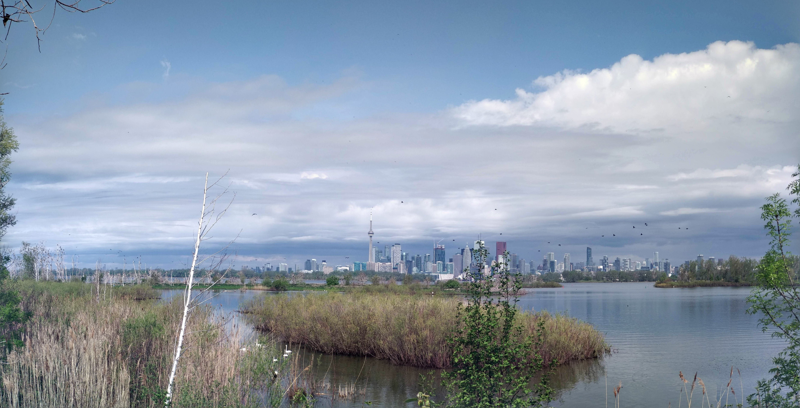

```{r setup, include=FALSE}
# These are the global knitr options.
knitr::opts_chunk$set(echo = TRUE,     # by default code will be printed out 
                      message = FALSE, # by default messages are suppressed
                      warning = FALSE) # by default warnings are suppressed
```

# Background

This is an example rmarkdown document you can use to complete the [*R4EnvChem* Tutorial](https://davidrosshall.github.io/R4EnvChem/r-tutorial-exercise.html). It showcases some important `rmarkdown` features. Assuming you've downloaded the entire *R4EnvChem* project template, and downloaded the packages listed in [Section 5](https://davidrosshall.github.io/R4EnvChem/r-tutorial-exercise.html), it should work out of the box. Remember, there's the PDF (what you'd hand it/present) and the rmarkdown file (what you use to code and *generate* the PDF); you'll be modifying the latter. 


# Task 1: Copying project template

See instructions in [Section 5](https://davidrosshall.github.io/R4EnvChem/r-tutorial-exercise.html) and download a copy of the [*R4EnvChem Project Template*](https://github.com/DavidRossHall/R4EnvChem-ProjectTemplate) onto your computer. 


# Task 2: Installing packages

See instructions in [Section 5](https://davidrosshall.github.io/R4EnvChem/r-tutorial-exercise.html) and install the following packages if you haven't done so already: 

  - `tidyverse`
  - `rmarkdown`
  - `tinytex`
  
Verify that you have everything installed by opening the `Rmarkdown-example.rmd` file in *RStudio* and knitting it (*knit* button top right, or see [Section 4](https://davidrosshall.github.io/R4EnvChem/using-r-markdown.html#how-to-run-r-code-in-r-markdown)). You should recreate this exact document. 

# Task 3: Importing your dataset

In the `rmarkdown` file, modify the following code to import a different ECCC National Airborne Pollution Surveillance (NAPS) dataset from Quercus or one already listed in the `/data` sub-folder: 

```{r}
library(tidyverse)

# Pick a different dataset, Toronto is sooooooo passé
airData <- read_csv(file = "data/2018-07-01_60430_Toronto_ON.csv")
head(airData)
```

# Task 4: Images

Download an image of your chosen city to the `/images` sub-folder. Then modify the `rmarkdown` file to display it (your image should reflect the city from your dataset):

{width=20%, height=20%}

# Task 5: Visualizations

Modify the `rmarkdown` file to generate a plot of your data. *Remember* to change the plot title and figure caption to reflect your new dataset. 

```{r, fig.cap="Time series plot of ambiant airborn pollutant concentrations measured by downtown Toronto NAPS station 60430"}

ggplot(data = airData, 
       aes(x = date.time, 
           y = concentration, 
           colour = pollutant)) +
  geom_line() +
  labs(title = "Toronto 60430 Air Quality")

```

# Task 6: Visualizations 2: Redux

Using the same data from [Task 5: Visualizations] create a new plot to visualization a different aspect of your data. 

```{r}

# Try and make another type of visualization with your data (i.e. box plot, violin plot)
# or enhance the default geom_line plot (i.e. marginal histograms, aesthetic changes)


```

